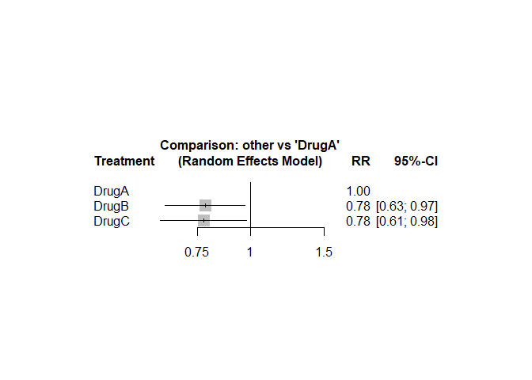

Network Meta Analysis, and comparisons
================
Joshua Edefo
2024-10-01

``` r
knitr::opts_chunk$set(echo = TRUE)
```

Libraries

``` r
library(netmeta)
```

    ## Warning: package 'netmeta' was built under R version 4.3.3

    ## Loading required package: meta

    ## Warning: package 'meta' was built under R version 4.3.2

    ## Loading 'meta' package (version 6.5-0).
    ## Type 'help(meta)' for a brief overview.
    ## Readers of 'Meta-Analysis with R (Use R!)' should install
    ## older version of 'meta' package: https://tinyurl.com/dt4y5drs

    ## Loading 'netmeta' package (version 2.9-0).
    ## Type 'help("netmeta-package")' for a brief overview.
    ## Readers of 'Meta-Analysis with R (Use R!)' should install
    ## older version of 'netmeta' package: https://tinyurl.com/kyz6wjbb

``` r
library(usethis)
```

    ## Warning: package 'usethis' was built under R version 4.3.2

Data for direct comparisons

``` r
data <- data.frame(
  study = c("Study1", "Study2", "Study3"),
  treatment1 = c("DrugA", "DrugA", "DrugB"),
  treatment2 = c("DrugB", "DrugC", "DrugC"),
  TE = c(log(1.2), log(1.4), log(0.9)), # Log-transformed effect size (e.g., log Risk Ratio)
  seTE = c(0.1, 0.12, 0.15) # Standard error of the log effect size
)
```

Perform network meta-analysis

``` r
nma <- netmeta(
  TE = data$TE,      # Treatment effect (log RR)
  seTE = data$seTE,  # Standard error
  treat1 = data$treatment1,  # First treatment
  treat2 = data$treatment2,  # Second treatment
  studlab = data$study,      # Study labels
  sm = "RR"                  # Summary measure: Risk Ratio
)

# Show results
print(nma)
```

    ## Number of studies: k = 3
    ## Number of pairwise comparisons: m = 3
    ## Number of treatments: n = 3
    ## Number of designs: d = 3
    ## 
    ## Common effects model
    ## 
    ## Treatment estimate (sm = 'RR', comparison: other treatments vs 'DrugA'):
    ##           RR           95%-CI     z p-value
    ## DrugA      .                .     .       .
    ## DrugB 0.7885 [0.6627; 0.9382] -2.68  0.0074
    ## DrugC 0.7735 [0.6360; 0.9408] -2.57  0.0102
    ## 
    ## Random effects model
    ## 
    ## Treatment estimate (sm = 'RR', comparison: other treatments vs 'DrugA'):
    ##           RR           95%-CI     z p-value
    ## DrugA      .                .     .       .
    ## DrugB 0.7810 [0.6267; 0.9734] -2.20  0.0278
    ## DrugC 0.7751 [0.6120; 0.9817] -2.11  0.0346
    ## 
    ## Quantifying heterogeneity / inconsistency:
    ## tau^2 = 0.0068; tau = 0.0826; I^2 = 30.4%
    ## 
    ## Tests of heterogeneity (within designs) and inconsistency (between designs):
    ##                    Q d.f. p-value
    ## Total           1.44    1  0.2308
    ## Within designs  0.00    0      --
    ## Between designs 1.44    1  0.2308

``` r
# Plot the network
plot(nma)
```

<!-- -->

``` r
# Summary of the network meta-analysis
```

session information

``` r
sessionInfo()
```

    ## R version 4.3.1 (2023-06-16 ucrt)
    ## Platform: x86_64-w64-mingw32/x64 (64-bit)
    ## Running under: Windows 11 x64 (build 22631)
    ## 
    ## Matrix products: default
    ## 
    ## 
    ## locale:
    ## [1] LC_COLLATE=English_United Kingdom.utf8 
    ## [2] LC_CTYPE=English_United Kingdom.utf8   
    ## [3] LC_MONETARY=English_United Kingdom.utf8
    ## [4] LC_NUMERIC=C                           
    ## [5] LC_TIME=English_United Kingdom.utf8    
    ## 
    ## time zone: Europe/London
    ## tzcode source: internal
    ## 
    ## attached base packages:
    ## [1] stats     graphics  grDevices utils     datasets  methods   base     
    ## 
    ## other attached packages:
    ## [1] usethis_2.2.2 netmeta_2.9-0 meta_6.5-0   
    ## 
    ## loaded via a namespace (and not attached):
    ##  [1] magic_1.6-1         utf8_1.2.3          generics_0.1.3     
    ##  [4] xml2_1.3.6          lattice_0.21-8      lme4_1.1-35.1      
    ##  [7] digest_0.6.33       magrittr_2.0.3      evaluate_0.21      
    ## [10] grid_4.3.1          CompQuadForm_1.4.3  fastmap_1.1.1      
    ## [13] Matrix_1.6-1.1      purrr_1.0.2         fansi_1.0.4        
    ## [16] scales_1.3.0        numDeriv_2016.8-1.1 abind_1.4-5        
    ## [19] cli_3.6.1           rlang_1.1.1         munsell_0.5.0      
    ## [22] splines_4.3.1       yaml_2.3.7          tools_4.3.1        
    ## [25] nloptr_2.0.3        minqa_1.2.6         metafor_4.6-0      
    ## [28] dplyr_1.1.3         colorspace_2.1-0    ggplot2_3.4.4      
    ## [31] mathjaxr_1.6-0      boot_1.3-28.1       vctrs_0.6.3        
    ## [34] R6_2.5.1            lifecycle_1.0.3     fs_1.6.3           
    ## [37] MASS_7.3-60         pkgconfig_2.0.3     pillar_1.9.0       
    ## [40] gtable_0.3.4        glue_1.6.2          Rcpp_1.0.11        
    ## [43] xfun_0.40           tibble_3.2.1        tidyselect_1.2.0   
    ## [46] rstudioapi_0.15.0   knitr_1.44          htmltools_0.5.6    
    ## [49] nlme_3.1-162        rmarkdown_2.25      compiler_4.3.1     
    ## [52] metadat_1.2-0
